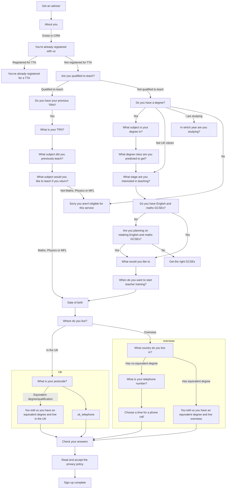

# Teacher training adviser signup flow

```mermaid
graph TD;
  get_an_adviser[Get an adviser] --> about_you[About you]

  about_you -- Exists in CRM --> already_registered[You're already registered with us]
  
  already_registered -- Registered for TTA --> registered_already[You've already registered for a TTA]
  already_registered -- Not registered for TTA --> qualified_to_teach[Are you qualified to teach?]

  qualified_to_teach -- Qualified to teach --> have_trn[Do you have your previous TRN?]
  qualified_to_teach -- Not qualified to teach --> have_degree[Do you have a degree?]

  have_trn -- Yes --> trn[What is your TRN?]
  trn --> previous_subject[What subject did you previously teach?]
  previous_subject --> next_subject[What subject would you like to teach if you return?]

  next_subject -- Maths, Physics or MFL --> date_of_birth[Date of birth]
  next_subject -- Not Maths, Physics or MFL --> not_eligible[Sorry you aren't eligible for this service]

  have_degree -- Yes --> what_degree[What subject is your degree in?]
  have_degree -- Not UK citizen --> what_stage[What stage are you interested in teaching?]
  have_degree -- I am studying --> what_year[In which year are you studying?]
  have_degree -- No --> not_eligible

  what_degree --> what_class_predicted[What degree class are you predicted to get?]
  what_class_predicted --> what_stage
  what_stage --> gcses[Do you have English and maths GCSEs?]

  gcses -- No --> retake_gcses[Are you planning on retaking English and maths GCSEs?]
  gcses -- Yes --> subject[What would you like to]

  retake_gcses -- Yes --> subject
  retake_gcses -- No --> get_gcses[Get the right GCSEs]

  subject --> start_teacher_training[When do you want to start teacher training?]
  start_teacher_training --> date_of_birth[Date of birth]
  date_of_birth --> where_do_you_live[Where do you live?]

  where_do_you_live -- In the UK --> address[What is your postcode?]
  where_do_you_live -- Overseas --> country[What country do you live in?]

  subgraph overseas
    country -- Has no equivalent degree --> overseas_telephone[What is your telephone number?]
    country -- Has equivalent degree --> overseas_degree[You told us you have an equivalent degree and live overseas]

    overseas_telephone --> choose_a_time[Choose a time for a phone call]
  end

  subgraph UK
    address -- Equivalent degree/qualification --> equivalent_degree[You told us you have an equivalent degree and live in the UK]
    address --> uk_telephone
  end

  choose_a_time --> check_your_answers[Check your answers]
  uk_telephone --> check_your_answers
  equivalent_degree --> check_your_answers
  overseas_degree --> check_your_answers

  check_your_answers --> privacy_policy[Read and accept the privacy policy]
  privacy_policy --> complete[Sign up complete]
```
